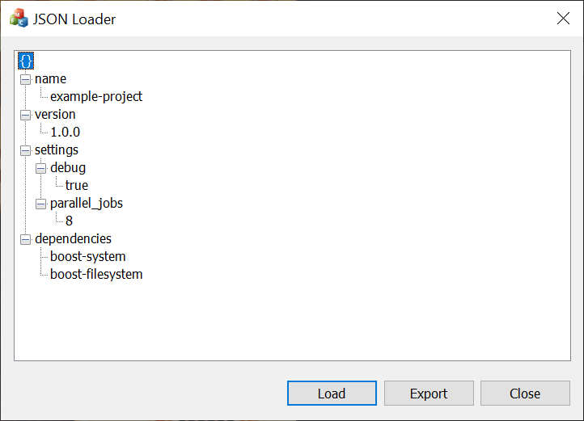

# Load JSON into an MFC CTreeCtrl

```
{
  "name": "example-project",
  "version": "1.0.0",
  "settings": {
    "debug": true,
    "parallel_jobs": 8
  },
  "dependencies": [
    "boost-system",
    "boost-filesystem"
  ]
}
```

is shown as:



## Building

- Make sure you have downloaded boost
- Build `boost::json` if you haven't already
  - `.\b2 --with-json`
- Set environment variable BOOST_ROOT to point to your boost path
- Load the `.slnx` file into Visual Studio
